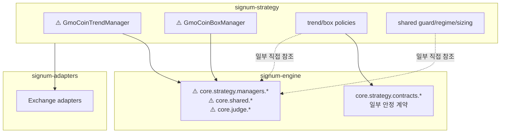
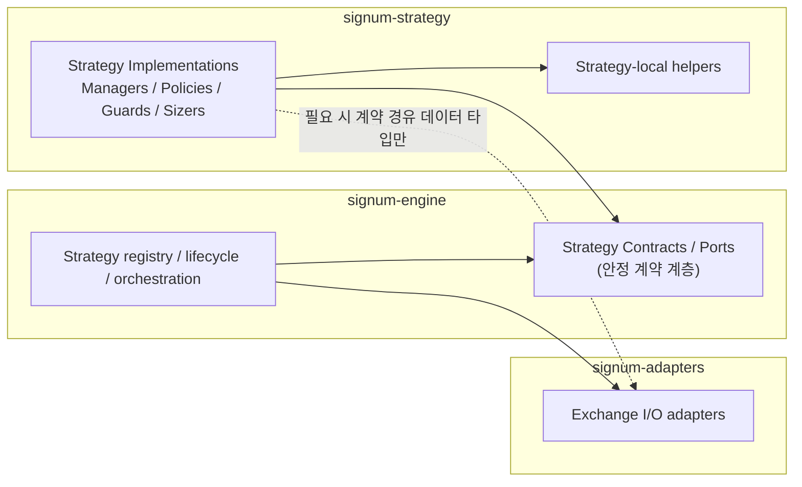

# signum-strategy Business Requirements Document

> **서비스**: `signum-strategy`
> **날짜**: 20260705
> **폴더**: `docs/20260705_01_strategy-abstraction-refactor/BRD.md`
> **스택**: Python / FastAPI / PostgreSQL
> **참조**: `signum-engine/docs/20260630_01_engine-abstraction-refactor/BRD.md` (플랫폼 조립 분리 방향 참조)

---

## 0. 한눈에 보기 (Executive Summary)

> **이 BRD를 한 문장으로**: `signum-strategy`가 현재 `signum-engine`의 `core.*` 구현에 직접 결합되어 전략 저장소라기보다 엔진 내부 모듈처럼 동작하는 문제를, **전략 계약(contracts/ports)과 전략 구현(runtime implementations)을 분리하고 레포 간 참조 방향을 재정의**하여 해결한다.

### 핵심 변화 한눈에 보기

| 항목 | 지금 (Before) | 이 BRD 완료 후 (After) |
|------|--------------|------------------------|
| 전략 저장소 역할 | 엔진 구현체에 강결합된 보조 패키지 | 독립된 전략 구현 저장소 |
| 의존 방향 | `signum-strategy -> signum-engine core.*` 직접 참조 다수 | `signum-strategy -> 안정된 contracts/ports` 중심 참조 |
| 매니저 기반 클래스 | `core.strategy.managers.gmo_coin_base` 직접 상속 | 엔진 런타임과 분리 가능한 전략 실행 계약 기반 구성 |
| 정책 계층 | 계약 타입과 엔진 유틸이 혼재 | 정책은 전략 계약에만 의존, 런타임 보조 유틸 참조 최소화 |
| 테스트 방식 | 엔진/DB/실행 컨텍스트 이해 없이 단위 테스트 어려움 | 정책/가드/사이징을 독립 단위 테스트 가능 |
| 레포 간 설계 검토 | 참조 규칙이 코드 관성에 의존 | Architecture/HLD에서 참조 원칙을 리뷰 가능한 상태 |

---

## 1. 목적 (Purpose)

`signum-strategy`는 `signum-engine` 위에서 실행되는 구체 전략 구현 저장소로, 현재 GMO Coin 추세추종(`GmoCoinTrendManager`)과 박스권 역추세(`GmoCoinBoxManager`) 및 관련 정책, 가드, 레짐 분류, 사이징 로직을 담고 있다.

그러나 현재 구조는 전략 저장소가 엔진의 안정된 계약층을 구현하는 방식이 아니라, 엔진 내부 구현(`core.strategy.managers.gmo_coin_base`, `core.shared.signals`, `core.judge.analysis.box_detector` 등)에 직접 기대는 방식으로 성장했다. 그 결과 `signum-strategy`는 별도 레포임에도 독립 진화가 어렵고, 새 전략을 추가하거나 기존 정책을 수정할 때 어떤 엔진 내부 코드까지 함께 이해해야 하는지 경계가 흐려져 있다.

이 BRD는 `signum-strategy`의 비즈니스 역할을 "전략 구현 저장소"로 다시 명확히 하고, 다음 요구사항을 정의한다.
- **추상화와 구현 분리**: 전략 계약(Protocol/ABC/Port)과 전략 런타임 구현을 분리
- **참조 방향 재정의**: `signum-engine`, `signum-strategy`, `signum-adapters` 간 의존 방향을 명시
- **테스트 가능 구조 확보**: 전략 정책과 판단 보조 로직을 엔진/DB 없이 검증 가능하게 정리

---

## 2. 현재 상태 요약 (Current-State Summary)

### 구현되어 있는 것
- 구체 전략 매니저 2종
  - `signum_strategy.gmo_coin.trend.manager.GmoCoinTrendManager`
  - `signum_strategy.gmo_coin.box.manager.GmoCoinBoxManager`
- 전략별 정책 계층
  - 추세 전략: `trend/policies/*`
  - 박스 전략: `box/policies/*`
- 공유 전략 보조 계층
  - 가드: `shared/guard/*`
  - 레짐: `shared/regime/*`
  - 사이징: `shared/sizing/margin_sizer.py`
- 문서
  - `docs/TREND_FOLLOWING.md`
  - `docs/BOX_MEAN_REVERSION.md`
  - `docs/PARAM_GROUPS_SPEC.md`
- 패키지 배포
  - `pip install git+https://github.com/soobo-sim/signum-strategy.git@main`

### 구현되어 있지 않은 것
- 전략 저장소 전용 `contracts/ports` 계층
- `signum-engine` 구현체와 분리된 전략 런타임 계약 레이어
- 레포 간 공식 참조 방향 문서
- 정책/가드/사이징 독립 테스트 스위트
- `signum-engine` 내부 `core.*` 의존을 단계적으로 축소하는 이행 계획

### 현재 의존 상태에서 확인된 사실
- `pyproject.toml`는 `signum-engine`, `signum-adapters`를 직접 의존성으로 선언한다.
- `src/` 내 `core.*` import가 89건 존재한다.
- 정책 계층 일부는 이미 `core.strategy.contracts.*`를 사용하지만, 매니저는 여전히 `core.strategy.managers.gmo_coin_base` 구현체를 직접 상속한다.
- 전략 정책 내부에서 `core.shared.signals`, `core.shared.box_signals`, `core.judge.analysis.box_detector` 같은 엔진 구현 보조 모듈 참조가 남아 있다.

### 현재 구조 그림

> ⚠️ 표시된 부분이 이번 BRD에서 분리 대상인 결합 지점이다.

---

## 3. 비즈니스 문제 (Business Problem)

| # | 문제 (원인) | 실무 증상 | 비즈니스 영향 |
|---|------------|-----------|---------------|
| 1 | 전략 저장소가 엔진 내부 구현(`core.*`)에 직접 의존한다 | 전략 코드만 보려 해도 엔진 내부 파일들을 함께 추적해야 한다 | 저장소 역할이 불명확해지고 신규 개발자 온보딩 비용이 증가한다 |
| 2 | `GmoCoinTrendManager`, `GmoCoinBoxManager`가 `core.strategy.managers.gmo_coin_base` 구현체를 직접 상속한다 | 전략 매니저를 독립 패키지처럼 교체·실험·배포하기 어렵다 | 전략 추가 속도가 저하되고 레포 분리의 이점이 사라진다 |
| 3 | 정책 계층이 계약 타입과 엔진 보조 유틸에 혼재 의존한다 | 정책 로직을 수정할 때 어떤 레이어 변경인지 판단이 어렵다 | 추상화 수준이 흐려져 회귀 위험이 커진다 |
| 4 | `signum-engine`, `signum-strategy`, `signum-adapters` 간 공식 참조 규칙이 없다 | 코드가 먼저 참조 방향을 결정하고 문서는 뒤따라간다 | 아키텍처 리뷰 없이 결합이 누적된다 |
| 5 | 전략 로직을 검증하는 테스트가 smoke 수준에 머문다 | 단위 정책 회귀를 빠르게 잡기 어렵다 | 배포 전 품질 게이트가 약해지고 버그 탐지 시점이 늦어진다 |
| 6 | 패키지 의존이 `signum-engine @ git+...` 전체 단위로 묶여 있다 | 전략 저장소가 필요한 것보다 넓은 엔진 구현에 종속된다 | 버전 관리와 계약 안정성 관리가 어려워진다 |

---

## 4. 비즈니스 목표 (Business Goals)

| Goal ID | 목표 | 성공 지표 (측정 가능) |
|---------|------|----------------------|
| G1 | 전략 저장소의 책임을 전략 구현으로 명확히 한다 | 새 전략 추가 시 `signum-engine` 내부 구현 수정 없이 `signum-strategy` 내부 변경만으로 완료 가능한 구조를 목표로 설계한다 |
| G2 | 전략 계층의 테스트 가능성을 강화한다 | 정책/가드/사이징 로직을 DB·HTTP 없이 단위 테스트할 수 있는 구조를 정의한다 |
| G3 | 엔진 직접 의존을 `contracts/ports` 중심으로 수렴시킨다 | `signum-strategy`가 참조하는 엔진 모듈을 안정된 계약 계층 중심으로 재배치하는 목표 구조를 정의한다 |
| G4 | 레포 간 참조 방향을 문서로 고정한다 | `signum-engine ↔ signum-strategy ↔ signum-adapters`의 책임과 단방향 참조 원칙을 BRD 및 후속 Architecture/HLD에서 검토 가능하게 만든다 |
| G5 | 전략 구조 파악 비용을 줄인다 | 전략 변경 시 개발자가 확인해야 하는 계층을 `contracts/ports -> strategy implementation -> adapter boundary` 흐름으로 설명 가능한 상태를 만든다 |

---

## 5. 페르소나 (Personas)

- **Strategy Developer** — 새 전략이나 정책을 구현하는 개발자
  → 엔진 내부 구현을 따라가지 않고 전략 계약 위에서 기능을 추가할 수 있다.
- **Quant Developer** — 진입·청산·가드 로직을 실험하는 개발자
  → 정책 계층만 독립적으로 비교·실험·테스트할 수 있다.
- **System Operator** — 배포·헬스체크·운영 장애를 담당하는 운영자
  → 전략 저장소와 엔진 저장소의 책임 경계가 명확해져 장애 원인 추적이 쉬워진다.
- **Architecture Reviewer** — 레포 경계와 의존 방향을 검토하는 설계 담당자
  → 어떤 저장소가 어떤 계약만 참조해야 하는지 문서로 리뷰할 수 있다.

---

## 6. 범위 (Scope)

### In Scope (포함)
- `signum-strategy` 관점의 전략 계약/구현 분리 요구사항 정의
- `signum-engine`, `signum-strategy`, `signum-adapters` 간 참조 방향 원칙 정의
- 전략 매니저, 정책, 가드, 레짐, 사이징 계층의 책임 재정의
- `contracts/ports` 중심 구조 목표 제시
- 단위 테스트 가능성 확보를 위한 구조 요구사항 정의
- 후속 Architecture/HLD에서 검토할 레포 경계 이슈 명시

### Out of Scope (제외)
- 신규 전략(3번째 이상) 실제 구현
- 기존 매매 규칙·진입/청산 알고리즘 변경
- DB 스키마 변경
- API 응답 포맷 및 엔드포인트 계약 변경
- `signum-adapters`의 실제 구현 변경
- `signum-engine` 전체 재아키텍처링

### 목표 구조 그림

### 목표 상태 설명
- `signum-engine`은 전략을 실행·등록·생명주기 관리하는 플랫폼 역할만 담당한다.
- `signum-strategy`는 전략 구현과 전략 전용 보조 로직을 담당한다.
- `signum-strategy`는 엔진 구현 세부사항이 아니라, 전략 계약 계층에만 직접 의존하는 방향으로 정리한다.
- `signum-adapters`는 외부 거래소 I/O를 담당하며 전략 규칙을 직접 알지 않는다.

---

## 7. 주요 갭 (Key Gaps Identified)

| # | 갭 | 해소하는 문제 (#) |
|---|-----|-----------------|
| 1 | 전략 저장소 전용 `contracts/ports` 기준선이 문서화되어 있지 않다 | 1, 4, 6 |
| 2 | 전략 매니저가 엔진 구체 베이스 매니저를 직접 상속한다 | 2 |
| 3 | 정책/가드/레짐 계층이 계약 의존과 구현 의존을 혼합한다 | 3 |
| 4 | 레포 간 단방향 참조 원칙이 없다 | 4 |
| 5 | 단위 테스트 가능한 구조와 테스트 대상 경계가 정리되어 있지 않다 | 5 |
| 6 | 패키지 의존이 전체 엔진 패키지에 묶여 있어 필요한 계약만 별도 관리되지 않는다 | 6 |

---

## 8. 우선순위 프레임워크 (Prioritization Framework)

- **P1**: 전략 저장소와 엔진 사이의 경계를 바로잡는 기반 작업
- **P2**: 구조가 정리된 뒤 테스트성과 이해도를 높이는 작업
- **P3**: 구조 안정화 이후 확장성·배포 독립성을 높이는 작업

---

## 9. 우선순위별 요구사항 백로그

| 우선순위 | 요구사항 | 근거 |
|---------|---------|------|
| P1 | 전략 계약 계층과 구현 계층의 책임을 정의한다 | 나머지 모든 구조 변경의 전제가 된다 |
| P1 | `signum-engine`, `signum-strategy`, `signum-adapters` 참조 방향을 명문화한다 | 레포 간 결합 확산을 막기 위한 최우선 기준이다 |
| P1 | 전략 매니저의 엔진 직접 상속 의존을 분리 가능한 형태로 설계한다 | 독립 저장소 역할 회복의 핵심이다 |
| P2 | 정책/가드/레짐/사이징 계층을 계약 중심으로 재분류한다 | 로직 이해도와 유지보수성을 높인다 |
| P2 | 정책/가드/사이징 단위 테스트 가능 구조를 정의한다 | smoke 테스트 의존을 줄이고 회귀 탐지를 앞당긴다 |
| P3 | 패키지 의존성을 계약 중심 배포 단위로 재검토한다 | 레포 독립 배포·버전 관리 안정성을 높인다 |
| P3 | 전략 저장소 문서 체계를 구조 중심으로 보강한다 | 신규 전략 추가와 리뷰 효율을 높인다 |

---

## 10. 비기능 요구사항 (Non-Functional Requirements)

### 외부 호환성 (Compatibility)
- 기존 `signum_strategy.gmo_coin.*` 공개 import 경로는 가능한 범위에서 유지한다.
- 기존 `signum-engine`의 전략 등록 및 실행 계약은 깨지지 않아야 한다.
- `signum-adapters`와의 현재 통신 방식은 유지한다.

### 보안 (Security)
- API 키·거래소 시크릿은 계속 엔진/어댑터 설정 계층에서만 관리한다.
- 전략 저장소는 비밀정보를 직접 소유하지 않는다.

### 성능 (Performance)
- 전략 계약 분리로 런타임 경로에 의미 있는 추가 지연이 없어야 한다.
- 전략 정책 호출은 현재 주문/판단 주기와 동일한 시간 예산 내에서 동작해야 한다.

### 테스트 가능성 (Testability)
- 정책, 가드, 레짐 분류, 사이징은 DB·HTTP 없이 단위 테스트 가능해야 한다.
- 매니저 레벨 테스트는 엔진 런타임을 전부 기동하지 않고 핵심 계약 목(Mock Port)으로 검증 가능해야 한다.

### 관측 가능성 (Observability)
- 전략 의사결정 로그 prefix와 cycle context는 기존 수준을 유지한다.
- 어떤 저장소 계층에서 실패했는지 로그만으로 구분 가능한 구조를 목표로 한다.

### 데이터 무결성
- 전략 저장소 분리 과정에서 주문 크기, 손절가, 청산 신호 계산 결과가 현재와 동일하게 유지되어야 한다.
- 전략 판단 로직이 참조하는 입력 스냅샷 구조는 일관되게 유지해야 한다.

---

## 11. 리스크 및 완화책 (Risks and Mitigations)

| 리스크 | 가능성 | 영향 | 완화책 |
|--------|--------|------|--------|
| 계약 분리 과정에서 엔진과 전략 간 책임이 중복되거나 빠질 수 있다 | 중 | 높음 | Architecture 단계에서 책임 소유권 표를 먼저 확정한다 |
| 매니저 베이스 클래스 분리 시 기존 전략 동작이 미세하게 달라질 수 있다 | 중 | 높음 | 이번 BRD에서는 동작 변경 금지를 명시하고, HLD에서 어댑터/포트 경계만 먼저 분리한다 |
| `core.shared.*` 유틸 제거가 과도한 중복으로 이어질 수 있다 | 중 | 중 | 공통 유틸은 전략 계약에 필요한 것만 별도 공용 계층 후보로 분류한다 |
| 공개 import 경로 변경이 사용자 코드에 영향을 줄 수 있다 | 낮 | 중 | import alias 또는 점진 전환 기간을 설계한다 |
| 엔진 패키지 의존 축소가 배포 파이프라인 변경으로 번질 수 있다 | 낮 | 중 | BRD에서는 방향만 정의하고 실제 배포 단위 조정은 P3에서 검토한다 |

---

## 12. 가정 (Assumptions)

1. 기존 추세추종·박스권 전략의 매매 로직과 결과는 이번 범위에서 변경하지 않는다.
2. `signum-strategy`는 앞으로도 전략 구현 저장소 역할을 유지한다.
3. `signum-engine`은 전략 실행 플랫폼 역할을 유지한다.
4. `signum-adapters`는 거래소 I/O 계층으로 남고, 전략 규칙을 직접 소유하지 않는다.
5. ⚠️ 전략 계약 계층은 `signum-engine` 내부가 아니라 별도 안정 패키지 또는 별도 계약 모듈로 추후 분리될 가능성이 있다.
6. ⚠️ `core.strategy.contracts.*`는 향후 `signum-strategy`가 직접 참조 가능한 안정 API로 승격시키는 것이 바람직하다고 가정한다.
7. ⚠️ 공개 import 경로는 유지하는 방향이 우선이지만, 구조 정리에 필요하면 alias 계층을 둘 수 있다고 가정한다.

---

## 13. 추적성 (Traceability)

| BRD Goal | Epic ID |
|----------|---------|
| G1 | E1 |
| G2 | E3 |
| G3 | E1, E2 |
| G4 | E2 |
| G5 | E3 |

---

## 14. Handoff Package

- **완료 산출물**: 이 파일 (`BRD.md`)
- **미결 질문 및 확인 필요 가정**:
  - 전략 계약 계층을 `signum-engine` 내부 안정 모듈로 둘지, 별도 공용 패키지로 승격할지 결정 필요
  - 매니저 기반 클래스 분리 시 `signum-strategy` 내부에서 얼마나 많은 런타임 유틸을 자체 보유할지 결정 필요
  - 공개 import 경로 유지 범위를 HLD에서 구체화할 필요가 있음
- **권장 다음 에이전트**: `2.SDLC Architecture Agent`
- **선행 검토가 필요한 이유**:
  - 이번 요구사항의 핵심은 단일 저장소 내부 클래스 정리가 아니라, `signum-engine`·`signum-strategy`·`signum-adapters` 사이의 경계와 참조 방향 재설정이다.
  - 계약 소유권, 배포 단위, 공통 모듈 위치를 먼저 Architecture 수준에서 확정해야 이후 HLD가 흔들리지 않는다.
