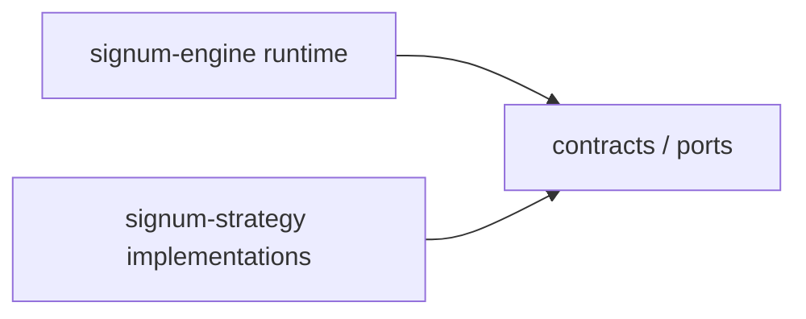
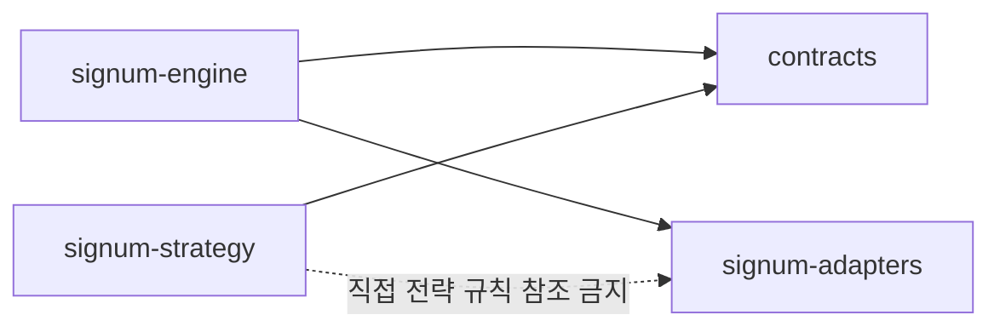

# signum-strategy Features Backlog

> **서비스**: `signum-strategy`
> **Epics**: [`Epics.md`](Epics.md)
> **BRD**: [`BRD.md`](BRD.md)
> **폴더**: `docs/20260705_01_strategy-abstraction-refactor/Features.md`

---

## Feature Overview

| Feature ID | 기능명 | Epic | 우선순위 |
|------------|--------|------|---------|
| F1 | 전략 계약 계층 정의 | E1 | P1 |
| F2 | 매니저 구현 의존 분리 설계 | E1 | P1 |
| F3 | 레포 간 참조 원칙 문서화 | E2 | P1 |
| F4 | 공통 유틸 소유권 재분류 | E2 | P2 |
| F5 | 정책·가드·사이징 테스트 경계 정의 | E3 | P2 |
| F6 | 전략 저장소 문서/테스트 진입점 정리 | E3 | P3 |

---

## P1 Features

### F1. 전략 계약 계층 정의
Epic: E1 | BRD Goal: G1, G3

#### 왜 필요한가? (배경)
현재 `signum-strategy`는 전략 저장소임에도 엔진 내부 구현과 안정 계약을 함께 참조한다. 이 상태에서는 어떤 것이 전략이 기대해도 되는 공식 인터페이스인지 개발자가 판단하기 어렵다.

#### 무엇을 하는가? (목표 상태)
전략이 직접 참조할 수 있는 계약 계층을 정의한다. 여기에는 전략 매니저가 기대하는 실행 포트, 정책이 기대하는 입력 스냅샷, 가드/사이징이 사용하는 타입 계약이 포함된다.

**Before → After 비교**

| 항목 | 지금 (Before) | 이 Feature 적용 후 (After) |
|------|--------------|--------------------------|
| 전략 참조 기준 | `core.*` 내부 모듈을 필요에 따라 직접 참조 | 전략이 참조할 공식 `contracts/ports` 목록이 명확함 |
| 코드 리뷰 기준 | import가 늘어나도 경계 판단 어려움 | 계약 계층 밖 직접 참조는 설계 위반으로 리뷰 가능 |

#### 개념 그림

#### 인수 조건 (구현 완료 체크리스트)
1. 전략 저장소가 직접 참조 가능한 계약 계층 목록이 문서로 명시된다.
2. 매니저, 정책, 가드, 사이징이 각각 어떤 계약을 기대하는지 설명 가능하다.
3. 계약 계층 밖 엔진 구현 참조는 예외 항목으로만 분류된다.

---

### F2. 매니저 구현 의존 분리 설계
Epic: E1 | BRD Goal: G1, G3

#### 왜 필요한가? (배경)
현재 `GmoCoinTrendManager`와 `GmoCoinBoxManager`는 엔진의 구체 베이스 매니저를 직접 상속한다. 이 구조는 전략 저장소를 독립 구현 저장소가 아니라 엔진 확장 폴더처럼 만든다.

#### 무엇을 하는가? (목표 상태)
전략 매니저가 엔진 런타임과 어떤 포트로 상호작용하는지 정의하고, 베이스 매니저 직접 상속 의존을 분리 가능한 구조로 설계한다. 즉시 코드 분리를 완료하는 것이 아니라, 어떤 책임을 엔진에 남기고 어떤 책임을 전략 저장소가 가진다는 기준을 세운다.

#### 인수 조건 (구현 완료 체크리스트)
1. 전략 매니저가 엔진으로부터 제공받아야 하는 런타임 책임 목록이 정의된다.
2. 전략 매니저 내부 책임과 엔진 플랫폼 책임이 분리되어 설명된다.
3. 후속 HLD에서 베이스 매니저 대체 또는 포트화 방향을 바로 설계할 수 있는 수준의 경계 정의가 존재한다.

---

### F3. 레포 간 참조 원칙 문서화
Epic: E2 | BRD Goal: G4

#### 왜 필요한가? (배경)
현재는 레포 경계를 넘는 import가 설계 원칙보다 구현 편의에 의해 늘어나고 있다. 이 상태를 방치하면 구조 개선 후에도 같은 결합이 반복된다.

#### 무엇을 하는가? (목표 상태)
`signum-engine`, `signum-strategy`, `signum-adapters`가 각자 무엇을 소유하고 무엇만 참조해야 하는지 단방향 원칙을 문서로 고정한다.

#### 개념 그림

#### 인수 조건 (구현 완료 체크리스트)
1. 세 레포의 책임 소유권 표가 존재한다.
2. 허용되는 직접 참조와 금지되는 직접 참조 예시가 문서에 포함된다.
3. Architecture 리뷰에서 이 원칙만으로 현재 import 문제를 설명할 수 있다.

---

## P2 Features

### F4. 공통 유틸 소유권 재분류
Epic: E2 | BRD Goal: G3, G4

#### 왜 필요한가? (배경)
`core.shared.signals`, `core.shared.box_signals`, `core.judge.analysis.box_detector`처럼 전략이 사용하는 공통 유틸이 엔진 구현 내부에 남아 있다. 이를 그대로 두면 전략 저장소가 계속 엔진 내부 세부사항에 결합된다.

#### 무엇을 하는가? (목표 상태)
전략이 필요한 공통 유틸을 계약 보조 계층, 전략 저장소 내부 유틸, 엔진 전용 런타임 유틸로 나눠 소유권을 재분류한다.

#### 인수 조건 (구현 완료 체크리스트)
1. 전략에서 사용하는 공통 유틸 목록이 분류된다.
2. 각 유틸이 어느 저장소 또는 계층에 속해야 하는지 설명된다.
3. 단순 복사 이전이 아니라 소유권 기준으로 재배치 원칙이 정의된다.

---

### F5. 정책·가드·사이징 테스트 경계 정의
Epic: E3 | BRD Goal: G2, G5

#### 왜 필요한가? (배경)
현재 테스트는 import smoke 수준에 머물러 있어, 전략 정책이 바뀌어도 세부 회귀를 빠르게 검출하기 어렵다.

#### 무엇을 하는가? (목표 상태)
정책, 가드, 레짐 분류, 사이징을 어떤 입력 목(Mock Input)과 계약 목(Mock Port)으로 검증할지 테스트 경계를 정의한다.

#### 인수 조건 (구현 완료 체크리스트)
1. DB·HTTP 없이 검증 가능한 테스트 대상 목록이 정의된다.
2. 각 테스트 대상이 기대하는 입력 스냅샷 또는 포트 목 형태가 설명된다.
3. smoke 테스트와 단위 테스트의 역할 구분이 문서화된다.

---

## P3 Features

### F6. 전략 저장소 문서/테스트 진입점 정리
Epic: E3 | BRD Goal: G5

#### 왜 필요한가? (배경)
구조를 분리해도 개발자가 어디서 시작해야 하는지 모르면 이해 비용이 계속 높다.

#### 무엇을 하는가? (목표 상태)
전략 저장소의 핵심 진입점을 계약, 구현, 테스트, 운영 문서 기준으로 재정리하여 신규 개발자가 빠르게 흐름을 이해할 수 있게 한다.

#### 인수 조건 (구현 완료 체크리스트)
1. 전략 저장소의 핵심 진입 문서와 디렉터리 흐름이 정리된다.
2. 신규 전략 검토 시 먼저 봐야 할 계약/구현/테스트 위치가 안내된다.
3. 레포 구조만으로도 전략 책임과 엔진 책임을 구분할 수 있다.

---

## Handoff Package

- **완료 산출물**: 이 파일 (`Features.md`)
- **미결 질문**:
  - 계약 계층의 실제 소유 저장소를 어디로 둘지 결정 필요
  - 공개 import alias 유지 수준 결정 필요
- **다음 권장 에이전트**: `2.SDLC Architecture Agent`
